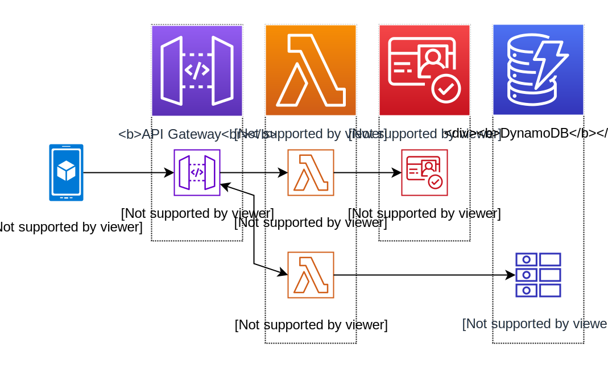

# aws-serverless-patterns

## **Workshop Overview: Serverless Patterns**

This repository provides a **Terraform implementation** of the [AWS Serverless Patterns workshop](https://catalog.workshops.aws/serverless-patterns/en-US/business-scenario#scope-of-the-system). The workshop demonstrates how to build a serverless solution for **food ordering app** that allows users to: 
- **Create Account:** Create a individual user account
- **Place Orders**: Customers can order food and drinks directly through the app.
- **Manage Profiles**: Users can update their personal information and preferences.
- **Track Orders**: Real-time updates are provided on order status (e.g., preparing, ready for pickup).

The app is powered by AWS serverless services like **Lambda**, **API Gateway**, **DynamoDB**, **SQS** and **EventBridge** ensuring a scalable, cost-effective, and low-maintenance solution. 

This workshop is perfect for learning how to design and implement serverless applications that solve real-world business problems, such as streamlining restaurant operations and improving customer experience.

## Implementation Overview
Each Service is described on a high level below. For a more in-depth description and implementation details please reference the original workshop link.
#### Service 1: Users
The users service is a microservice to add and update user accounts as well as restrict access to your application to registered users only. This service is implemnted in the users-synchronous folder.

### Service 2: Orders
The orders service is  microservice that manages orders placed by the users. It uses a synchronous architecture and also implements idempotency for error handling. This service is implemented in the orders-synchronous-idempotent folder.

### Service 3: User Profile Service
This service is used to allow the user to manage his account. He can edit his personal address and add restaurants to his favorites. It is implemented asynchronously and can be found in the userprofile-asynchronous folder.

### Service 4: Order Status Service
The order status service allows the customers to track order status. Delivery employees and restaurant staff can update the status of the order. This service is implemented using a event driven architecture and can be found in the oderstatus folder.
